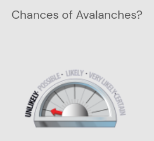
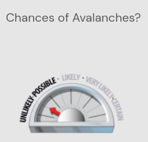
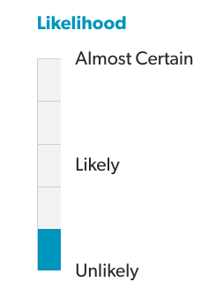
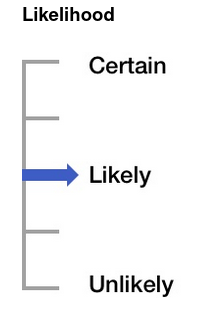
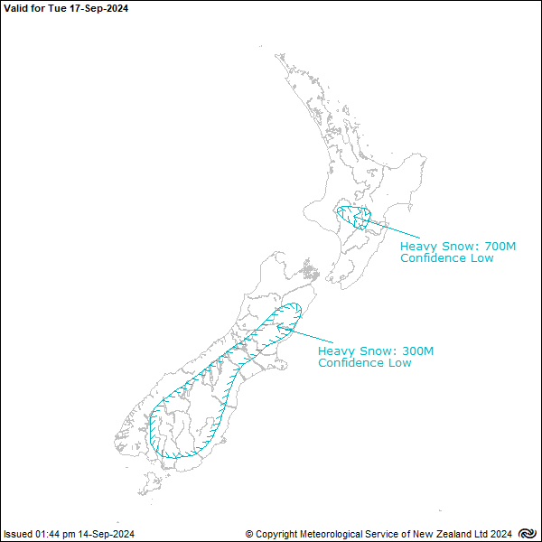

During the 2023-24 forecasting season for Avalanche Georgia, there was a vibrant discussion among those responsible for producing the forecast as to the value of using "likelihood" as defined by CMAH in the public forecast. The team working on producing this forecast has (at the time of writing) a background in the New Zealand and Canadian avalanche forecasting systems.

**ASK: What is your understanding of likelihood?**

**ASK: How do you think about likelihood with respect to human involvement vs natural trigger?**

**ASK: How do you think about likelihood with respect to your own personal involvement?**

**ASK: Some problems are easier to avoid than others, how does this impact your interpretation of likelihood?**

**ASK (OPTIONAL): Is likelihood being used by some people as a substitute for "hazard"?**

*A Conceptual Model for Avalanche Hazard (CMAH)* @stathamConceptualModelAvalanche2018 is one of the most cited papers used as the basis for modern avalanche forecasting (CITATION NEEDED). One of the terms that it attempts to define is “Likelihood of avalanches”:

> *Likelihood of avalanche(s) is the chance of an avalanche releasing within a specific location and time period, regardless of avalanche size. While probability is dependent on scale, in practice forecasters express their likelihood judgments independently of scale, using qualitative terms such as possible or almost certain ( @stathamAVALANCHEHAZARDDANGER2008 ) across different scales.* 
>
> @stathamConceptualModelAvalanche2018

It goes on to say:

> *The CMAH uses the terms ‘unlikely,’ ‘possible,’ ‘likely,’ ‘very likely’ and ‘almost certain’ on an ordinal scale to express the likelihood of avalanche(s). Although many studies of quantified verbal probability expressions have identified consistent probability ranges for these terms (e.g., Kent 1964; Reagan et al. 1989; Mosteller and Youtz 1990; Mastrandea et al. 2010), the scale dependence of probability values and the scale independence of this likelihood terminology rule out associating probability values for this multi-scale approach.*
>
> @stathamConceptualModelAvalanche2018

It was argued by experience that "Likelihood" can be a useful tool for communicating information about the seriousness of a particular avalanche problem.

The definition as provided by CMAH has several shortcomings which can cause confusion even among avalanche forecasters:

* It does not define what "specific location" is. Is it any possible location within the forecast area? Or any possible location that is avalanche terrain? Or is it any possible location within the elevation bands and aspects that the problem type is has been found in? There are many possible interpretations.
* What is the mechanism of release? If it is human triggered, what kind of load is being applied?
* It attempts to redefine the term "Likelihood" in which is already synomous with "Probability" in the English Language, and is well defined within a mathematical context. This is especially problematic from a standpoint of people consuming the forecast for whom English may be their second language or they may be relying on automatic translation.
* It states that likelihood is independent of scale, and yet by choosing to present likelihood as a graphic in forecasts it has every appearance of possessing a scale as it is most commonly used. The appearance of the graphic impacts how the scale is interpreted. See [Figure 1](#fig:avalanche-ca-chance-1), [Figure 2](#fig:avalanche-ca-chance-2), [Figure 3](#fig:avalanche-nz-likelihood) and [Figure 4](#fig:uac-likelihood).
* In practice (CITATION NEEDED), **ASK** forecasters map the probability scale that they calculate in their heads (or with a matrix derived from other scales) to the value terms that are provided ("Possible", "Unlikely", etc), so in effect it can be seen to represent a scale and "Likelihood" by the CMAH definition cannot entirely escape it. Forecasters (and informed members of the public) often use a different definition for "Likelihood" than the one provided by CMAH, one that is far more complex and which adapts the the nature of the specific avalanche problem, whether it is one that is dominated by human trigger possibility, or one that is dominated by natural trigger events.
* The use of language terms for likelihood values could introduce extra ambiguity in translation to other languages, and for those who are reading in their second language. This issue is partially highlighted in ADAM @mullerCOMBININGCONCEPTUALMODEL2016 *"We find the terms used in the EDS and the BM ambiguous and partially redundant. The different languages in Europe pose certain challenges while identifying common terms. A literal translation of one term into another language sometimes is accompanied by a slight change in meaning or common perception of this term. This potential change in perception of one term could lead to a
different perception in the avalanche danger assessment. A translation should aim at adhering to the definition rather than being literally correct. This will require a careful translation process"*.

  There is also evidence that even within a single language there is a wide range of interpretations for likelihood values, as presented by the avalanche practitioners survey in @LikelihoodScaleAvalanche

  > "While this large range and overlap is startling and potentially challenging to work with, it is not altogether surprising. There is a depth of research that has consistently found verbal descriptions of uncertainty, such as “unlikely,” are interpreted differently by different people and also differ widely for the same people in different contexts (e.g. Nakao et al., 1983; Theil, 2002; Morgan, 2017)."
  > 
  > @LikelihoodScaleAvalanche

{#fig:avalanche-ca-chance-1}

{#fig:avalanche-ca-chance-2}

{#fig:avalanche-nz-likelihood}

{#fig:uac-likelihood}

Some of these points and more are discussed in *The Likelihood Scale in Avalanche Forecasting* @LikelihoodScaleAvalanche

There is a struggle here between wanting to provide a value convenient for communication, and poviding a framework which leaves little room for disagreement between those attempting to produce the forecast, and little room for misinterpretation by those who are consuming the forecast.

With this in mind we still sought to use this property in our forecasting system as a tool for communication, and resolved to find a way to solve these shortcomings.

Seeking a more rigorous definition for "Likelihood" we took the scale and matrix defined by the ADAM paper  ( @mullerCOMBININGCONCEPTUALMODEL2016 ) which provides what is arguably a more specific definition of "Likelihood": 

> Likelihood of triggering an avalanche of a specific avalanche problem, as a product of sensitivity to triggers (snowpack stability) and spatial distribution.
>
> @mullerCOMBININGCONCEPTUALMODEL2016

Because the definition of "Likelihood" according to ADAM is already purely derived from sensitivity and distribution, we implemented this value as automatically calculated via the matrix this paper provided in Figure 4. @mullerCOMBININGCONCEPTUALMODEL2016 , to reduce subjectivity of interpretation.

This caused some disagreement among the team while we discussed this, and the following downsides to employing "Likelihood" as defined ADAM were proposed:

* In the Canadian and New Zealand forecasting systems there are 5 values for likelihood instead of 4 as presented in the ADAM paper.
  * People who are used to those systems may find the difference confusing.
  * The extra resolution in CMAH might be useful.
  * Having a definition based purely on a matrix might not fit how users interpret the value in practice.
* The likelihood of a naturally triggered avalanche occurring does not fit nicely within the mapping provided in Table 2 of @mullerCOMBININGCONCEPTUALMODEL2016 , for example some natural avalanches such as wet slabs and glide slabs may be difficult for human rider to trigger, and could be defined as "Unreactive", and yet their actual probability of triggering in a natural event may be higher.

Some arguments were raised by our group against attempting to provide a more precise definition for "Likelihood":

* Avalanche forecasting is already a process that involves large errors and many grey areas due to the lack of resources with observations, weather forecasting, and our limited understanding of avalanche and snow mechanics, and having precise definitions does little to help the situation. 
* Avalanche forecasting and communication is at least partially an "art" and having imprecise definitions leaves room for performing it.
* Improving forecasting to better quantify risks or improve communication may be feasible, may cost a considerably amount of money to research and deploy, and the appetite to do so is lower than other forms of public forecasting. We are willing to accept a higher degree of error or imprecision in a forecast designed for recreationalists who already willingly expose themselves to what the general public perceive to be an especially risky situation. The discussion may be different it it was purely a discussion around forecasting for public road avalanche risk management.
* Having a forecast that is consistent across regions is good for those who travel between them, any changes ideally should be made simultaneously making it more difficult to introduce changes to communication as more people rely on it and may need to be re-educated.

However, some of the same arguments could be made against making precise observations in the field, and yet the industry has a focus on repeatability and accuracy as much as is practical given the limitations of available resources. 

> *Even if avalanche forecasting is probabilistic and includes uncertainty, it should be grounded in clear definitions and uncertainty should not stem from ambiguous definitions but the nature of the problem.*
>
> @schweizerRelationAvalancheOccurrence2019

> *Discrepancy between interpretations of likelihood expressions has been shown to create communication problems (Fischer and Jungermann, 1996). It can reduce forecasting accuracy (e.g. Rapoport et al., 1990) and ultimately compromise decision making (Friedman et al., 2018).*
>
> @LikelihoodScaleAvalanche

Why should the logic be any different for the definitions of the terms we use in our forecast and which form its very basis? In a similar vein of logic, why make the situation any worse by perpetuating imprecision and sources of confusion in our forecasting process and presentation when the solutions (improved definitions) can easily be made available?

Weather forecasts do not provide information about temperature in the format of "very cold", "cold", "moderate", "hot", "extremely hot".  Wind speed and rain are an example where words are used in a qualitative fashion, such as "moderate" wind speed or "heavy" rain, but these are usually backed by strong quantitative definitions, and often accompanied by numbers.

Where uncertainty is involved, some weather forecasts include this information. One such example is [metservice's severe weather outlook](https://www.metservice.com/warnings/severe-weather-outlook) @metserviceSevereWeatherOutlook:

They have a clear and quantifiable definition of "Confidence":

> *"Low confidence:*
> 
> *A 20% likelihood (or 1 chance in 5) of a warning being issued.*
> 
> *Moderate confidence:*
> 
> *A 40% likelihood (or 2 chances in 5) of a warning being issued.*
>
> *High confidence:*
> 
> *A 60% likelihood (or 3 chances in 5) of a warning being issued."*
> 
> @metserviceSevereWeatherOutlook

If "Likelihood" is just to be used only as a tool designed to simplify communication about avalanche problems we still need a way to agree on what value to assign to it given a particular situation, and how it should be presented in order to most effectively communicate its meaning. This requires a definition that everyone agrees upon, to make it a more useful as a tool for communication.

Here are some different possibilities for how this could be achieved that address problems previously mentioned:

* Introduce some additional complexity into the definition that codifies how we actually think about likelihood.

  Here is one proposal:

  > *"Consider ANY avalanche path in the forecast region where the specified avalanche problem type is expected to exist. Likelihood of Avalanches is the chance of those avalanche paths releasing within the forecast time period, regardless of avalanche size."*
  >
  > @LikelihoodScaleAvalanche

  **ASK: After this discussion what other definitions can we come up with?**

  However this proposed still suffers from ambiguity around trigger mechanism.

  Here is another proposal:

  > *The probability of you encountering a specific avalanche problem during an average day of mountain recreation in the forecast area where no effort is made to avoid avalanches.*

  Here "average day of mountain recreation" will look very different by person and by area, activity, season, but perhaps this would be an advantage in some ways because it allows the definition to be adjusted by the forecasters to suit specifics of the region, audience and season being forecasted for. It also covers both the case of Natural and Human triggered avalanches by defining the time exposed to natural hazards and the amount direct exposure to avalanche slopes for human trigger interactions. Precise definitions for what an "average day of mountain recreation" would look like can be determined by the forecasting region, perhaps even using user survey data.

* Split "Likelihood" into "Likelihood of Natural Avalanches" and "Likelihood of Human Triggered Avalanches".
  
  Arguably the likelihood of human triggers is much more important, accident data shows that the risk from natural avalanches is about 10% of the risk from human triggering ( @tremperStayingAliveAvalanche2008 ).
* We can quantify the probabilities and uncertainties, perhaps alongside the word definitions, as suggested by @LikelihoodScaleAvalanche .
  
  > *Associating probability numbers with likelihood terms improves risk communication (e.g. Budescu et al., 2009; Budescu et al., 2012). Further, explicitly combining the term with the intended numerical range is more effective than having a separate descriptive table (Wintle et al., 2019). Writing “good chance (10-30%) of avalanche release” is more effective than having a separate table describing the 10-30% range for “good chance.”*
  > 
  > @LikelihoodScaleAvalanche

  And by using frequency statements:

  > *"Using frequency statements greatly improves understanding of probabilities and ensures the reference scales are defined (Gigerenzer and Edwards, 2003). For example, a frequency statement for a “20% chance of avalanches” could be translated to “20 out of every 100 avalanche paths.”*
  > 
  > @LikelihoodScaleAvalanche

-----------

## Feedback from Penzy

Depends on which avalanche problem you're talking about, whether it's a human triggered type avalanche. 

In the description when they say can be human triggered, understand that the likelhood can be affected by your own actions.

Roughly 90 percent of avanches that people are caught in are human triggered.

Doesn't look so closely at the likelihood. Trend, distribution that they noted, etc. Don't really look at the likelihood. More likely to look at distribution and whether they.

If it's listed then at all it's "Possible". Considerable or high, some of these problems can be bigger risk.

Why did we get rid of danger levels per problem type?

The definition that we actually use to interpret likelihood. 

Temperature is measurable. We accept a lower standard of safety and precision for avalanche forecasting designed recreationalists than things like airline safety or avalanche forecasts for public roads. Money.

https://www.metservice.com/warnings/severe-weather-outlook

-----------

TODO: It would be good to have more clarification on is the "art" of forecasting as it has been referred to.

-----------

TODO: Include the points in https://github.com/kellpossible/avalanche-report/issues/52 and reference this paper.

-----------

# References